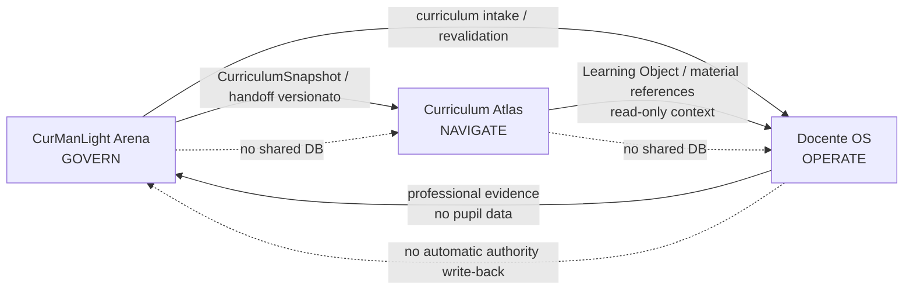
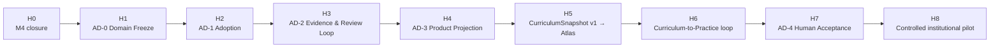

# CurManLight Arena

> **Governare il curricolo, renderlo comprensibile, trasferirlo alla pratica senza confondere autorità e operatività.**

[](https://github.com/antoniocorsano-boop/CurManLight_arena/actions/workflows/product-ci.yml)
[](https://github.com/antoniocorsano-boop/CurManLight_arena/actions/workflows/beta-release-contract.yml)
[](https://github.com/antoniocorsano-boop/CurManLight_arena/actions/workflows/curriculum-alignment.yml)

**CurManLight Arena** è il livello di **governance curricolare istituzionale** dell'ecosistema CurManLight. Gestisce fonti, provenienza, applicabilità, baseline curricolari, proposte, riesame, confini decisionali umani, stato di adozione/validazione e handoff versionati verso i sistemi a valle.

Arena **non è** il workspace quotidiano del docente e non deve diventarlo.

- **Arena governa**
- **Curriculum Atlas rende il curricolo intelligibile e navigabile**
- **Docente OS lo rende operativo**

## Accesso rapido

- **Beta pubblica:** https://antoniocorsano-boop.github.io/CurManLight_arena/
- **Curriculum Atlas — anteprima esplorativa S1, read-only/non autoritativa:** https://antoniocorsano-boop.github.io/Curriculum-Atlas/
- **Docente OS:** https://github.com/antoniocorsano-boop/docente-os-2026-27
- **Tracker maturità M4:** [issue #121](https://github.com/antoniocorsano-boop/CurManLight_arena/issues/121)
- **Decisione M4 in preparazione:** [PR #304](https://github.com/antoniocorsano-boop/CurManLight_arena/pull/304)
- **Roadmap di prodotto:** [docs/architecture/ARENA_PRODUCT_ROADMAP_2026_2027.md](docs/architecture/ARENA_PRODUCT_ROADMAP_2026_2027.md)
- **Mappa del repository:** [docs/REPOSITORY_STRUCTURE.md](docs/REPOSITORY_STRUCTURE.md)
- **Baseline normativa, tecnica e di assurance:** [docs/assurance/NORMATIVE_TECH_ASSURANCE_BASELINE.md](docs/assurance/NORMATIVE_TECH_ASSURANCE_BASELINE.md)
- **Indice documentale:** [docs/README.md](docs/README.md)

---

## Stato corrente

Lo stato formale deve essere letto dal [tracker #121](https://github.com/antoniocorsano-boop/CurManLight_arena/issues/121) e dagli artefatti di evidenza correnti.

Alla data di questa home:

- M4-S1 … M4-S7: implementazione e convergenza architetturale concluse;
- A3 / source applicability: chiusa tramite PR #290;
- candidata immutabile M4: `a315aa72ce68a52da7d4d960996b6470774104b0`;
- exact-head gates e Beta smoke: PASS sulla candidata;
- verifica umana mobile: PASS;
- verifica umana desktop sulla stessa candidata: ancora richiesta dal protocollo G5 prima dell'attivazione formale del token M4.

Pertanto la home **non usa claim di produzione piena** e non sostituisce il tracker o le ricevute di release.

---

## Missione

Arena deve poter rispondere, in modo verificabile e con provenienza esplicita, a queste domande:

1. Quale quadro normativo si applica a questa coorte?
2. Quali fonti sostengono il curricolo visualizzato?
3. Qual è la baseline curricolare di riferimento?
4. Che cosa è proposta, che cosa è stato riesaminato e che cosa è stato deciso?
5. Che cosa è stato adottato dall'istituto, per quale ambito e periodo?
6. Quali evidenze dalla pratica richiedono verifica o riesame?
7. Quale stato curricolare può essere trasferito, in modo esplicito e versionato, a Docente OS?

La North Star è:

```text
Context
  -> Applicability
  -> Source Registry
  -> Curriculum Baseline
  -> Proposal
  -> Review
  -> Institutional Decision
  -> Adoption
  -> Controlled Handoff
  -> Implementation Evidence
  -> Validation / Periodic Review
  -> Confirm or Revision Proposal
```

---

## Ecosistema canonico



### Confini non negoziabili

**Arena possiede:**
- fonti curricolari e provenienza;
- applicabilità nazionale/istituzionale;
- baseline e versioni curricolari;
- proposte e riesame;
- confini di autorità;
- stato di adozione/validazione;
- handoff espliciti e versionati;
- intake di evidenze professionali come input non autoritativo.

**Arena non possiede:**
- dati operativi individuali degli alunni;
- orario e diario quotidiano del docente;
- esecuzione delle lezioni;
- authoring operativo delle UDA;
- archivio materiali didattici quotidiani;
- valutazione automatica degli studenti;
- mutazioni automatiche di Docente OS o Atlas.

---

## Superfici principali

| Superficie | Funzione | Classe |
|---|---|---|
| **Home** | orientamento per ruolo, attività da svolgere, stato | GOVERN |
| **Curricolo** | quadro applicabile, contenuti, baseline, stato | GOVERN |
| **Riesame** | contributi, confronto, decision boundary | GOVERN |
| **Dal curricolo alla pratica** | verifica contesto + uscita verso Atlas/Docente OS | HANDOFF |
| **Documenti** | export, ricevute, handoff, tracciabilità | GOVERN / HANDOFF |
| **Fascicolo** | fonti, provenienza, source registry | GOVERN |
| **Verifiche** | prerequisiti, blocchi, readiness leggibile | GOVERN |
| **Guida** | human-task navigation e confini | SUPPORT |

La superficie di progettazione operativa non è un editor UDA Arena: è il **boundary hub** verso Atlas e Docente OS.

---

## Roadmap

La roadmap evita un nuovo feature train dispersivo. La priorità è chiudere il ciclo curricolare. Gli identificatori **H0–H8 sono orizzonti strategici, non fasi di esecuzione**: non sostituiscono né riordinano le fasi R0–R5 del completion reset canonico, che restano governate da `DUAL_SYSTEM_CANONICAL_RESET_2026-09-18.md` e dalla memoria condivisa.



| Orizzonte | Obiettivo | Gate |
|---|---|---|
| **H0** | chiudere formalmente M4 | same-candidate desktop HVA + decision receipt |
| **H1** | congelare dominio Adoption/Validation | `ARENA_AD0_DOMAIN_CONTRACT_FROZEN` |
| **H2** | separare decisione, baseline e adozione | `ARENA_AD1_ADOPTION_CANONICAL` |
| **H3** | evidenze, trigger e validation loop | `ARENA_AD2_VALIDATION_LOOP_CANONICAL` |
| **H4** | proiettare il modello nelle superfici esistenti | `ARENA_AD3_PRODUCT_PROJECTION_PASS` |
| **H5** | snapshot canonico Arena → Atlas | `CML-A1` / contract validation |
| **H6** | ciclo Arena ↔ Docente OS senza mutazione automatica | tranche C2P governate |
| **H7** | validazione umana end-to-end | `ARENA_AD4_HUMAN_ACCEPTANCE_PASS` |
| **H8** | pilot prolungato, metriche, manutenzione | evidence-based continuation |

Dettagli: [ARENA_PRODUCT_ROADMAP_2026_2027.md](docs/architecture/ARENA_PRODUCT_ROADMAP_2026_2027.md).

---

## Baseline normativa

La documentazione distingue sempre tra **riferimento normativo modellato**, **controllo tecnico verificato** e **certificazione legale**.

### Curricolo e ordinamento

| Riferimento | Uso nel prodotto | Stato ingegneristico |
|---|---|---|
| **D.M. 9 dicembre 2025, n. 221 — Indicazioni Nazionali 2025** | resolver di applicabilità per coorti in ingresso dal 2026/27; fonte N4 | modellato e coperto da test |
| **D.M. 16 novembre 2012, n. 254 — Indicazioni Nazionali 2012** | prosecuzione delle coorti non ancora migrate; fonte N5 | modellato e coperto da test |
| **D.M. 183/2024 — Educazione civica** | riferimento del repertorio e della documentazione curricolare | registrato; non usato come claim di certificazione |
| **D.M. 14/2024 — certificazione delle competenze** | riferimento curricolare/documentale per livelli e raccordi | registrato; non usato come claim di certificazione |

### Dati, accessibilità, AI

| Riferimento | Applicazione progettuale | Claim |
|---|---|---|
| **Reg. (UE) 2016/679 — GDPR** | minimizzazione, confine no-pupil-data in Arena, credenziali non persistite, authority server-side dove necessaria | baseline privacy-by-design; **nessuna certificazione legale implicita** |
| **L. 4/2004 + Linee guida AgID accessibilità** | keyboard/focus, reflow, target, dialog naming, contrast e Human Interaction evidence | assurance tecnica; dichiarazione di accessibilità resta responsabilità del soggetto titolare |
| **Reg. (UE) 2024/1689 — AI Act** | human-in-the-loop: AI può assistere/riassumere/proporre, non approvare o concedere autorità | governance reference; **nessuna attestazione di conformità automatica** |

Per la classificazione completa e le evidenze: [NORMATIVE_TECH_ASSURANCE_BASELINE.md](docs/assurance/NORMATIVE_TECH_ASSURANCE_BASELINE.md).

---

## Stack tecnologico

Fonte primaria: `package.json` e runtime corrente.

| Area | Tecnologia |
|---|---|
| UI | React 18, TypeScript |
| Build | Vite 6 |
| Routing | React Router 7 |
| Styling | Tailwind CSS 3 |
| State | Zustand |
| Persistenza locale | IndexedDB tramite Dexie |
| Persistenza istituzionale condivisa | Supabase/PostgreSQL dietro repository + RLS, dove previsto dal dominio |
| Icone | Lucide React |
| PDF | PDF.js |
| Unit/integration tests | Vitest 4 |
| Browser/E2E | Playwright 1.61 |
| Component assurance | Storybook 10 + a11y addon |
| CI/CD | GitHub Actions |
| Beta hosting | GitHub Pages con release identity esatta |

### Modello di persistenza M4

Arena usa un modello **bounded hybrid**:

- stato personale/non autoritativo: dispositivo locale;
- preferenze operative non autoritative: local storage controllato;
- artefatti istituzionali condivisi: repository server-side con membership/RLS;
- token OAuth: memoria di sessione, non storage durevole;
- database condiviso tra Arena, Atlas e Docente OS: **vietato**;
- canonical curriculum persistence: resta `legacy-only` nella limitazione governata M4 fino a gate di migrazione separato.

---

## Assurance e validazione

La promozione non dipende da una percentuale generica. È legata a evidenze su SHA esatti.

### Gate principali

- Product CI
- Beta Release Contract
- Curriculum Alignment
- Beta Identity Authority
- Human Interaction Model
- H3/H4 Authority Boundary
- S3 Critical Journey Browser Evidence
- Beta E2E Workflow
- dependency/security audit
- human acceptance su release immutabile quando richiesta

### Regola di release

```text
PR exact head
  -> automated gates
  -> immutable SHA deploy
  -> public release identity smoke
  -> human review on the same SHA
  -> governed merge/promotion
```

`main` è protetto tramite PR, required checks, branch-up-to-date, conversation resolution e blocco force-push/deletion secondo il contratto M4-S6.

---

## Struttura del repository

```text
CurManLight_arena/
├── src/
│   ├── domain/                 # contratti curricolari, authority, transfer, persistence
│   ├── features/               # superfici applicative
│   ├── infrastructure/         # adapter e repository esterni
│   └── __tests__/              # regression e contract tests
├── supabase/                   # schema/migrazioni/policy lato persistence condivisa
├── docs/
│   ├── architecture/           # decisioni e contratti canonici
│   ├── assurance/              # baseline normative/tecniche/evidence
│   ├── evidence/               # ricevute e protocolli di validazione
│   └── ...                     # audit e programmi storici
├── .human/                     # Human Tasks / Human Interaction contracts
├── .github/workflows/          # CI, release, security, HVA/browser gates
├── agent_skills/               # skill operative governate
├── scripts/                    # validation, release, agent tooling
├── tools/                      # toolchain e HIM validators
├── second-brain/               # archivio storico/conoscitivo, non autorità runtime
├── graphify-out/               # artefatti di grafo generati
├── AGENTS.md                   # istruzioni operative agenti
└── package.json                # stack e comandi
```

La root contiene anche documentazione storica precedente alla razionalizzazione corrente. **La presenza di un file in root non lo rende canonico.** Usare [docs/README.md](docs/README.md) come indice di precedenza.

---

## Avvio locale

Requisiti: Node.js compatibile con la toolchain corrente e npm.

```bash
npm ci
npm run dev
```

Verifiche principali:

```bash
npm run test:fast
npm run test
npm run build
```

Per Storybook:

```bash
npm run storybook
```

---

## Regole di contribuzione

1. nessun push diretto a `main`;
2. una capability deve avere un owner di dominio esplicito;
3. niente duplicazione di source of truth;
4. missing authority = fail closed;
5. proposal/review/decision/adoption non vanno collassati;
6. niente dati personali degli alunni nei contratti Arena ↔ Atlas ↔ Docente OS;
7. nuove feature cross-product richiedono contratto/versione e governance;
8. i test devono essere eseguiti sull'exact head;
9. la validazione umana non può essere sostituita dall'automazione;
10. una nuova roadmap non autorizza da sola l'implementazione di una tranche bloccata.

Vedi [CONTRIBUTING.md](CONTRIBUTING.md).

---

## Documenti canonici da leggere prima di modificare il prodotto

1. [AGENTS.md](AGENTS.md)
2. [Integrated Project Governed Memory](docs/architecture/INTEGRATED_PROJECT_GOVERNED_MEMORY_V1.md)
3. [Curriculum Adoption & Validation Development Guide](docs/architecture/CURRICULUM_ADOPTION_VALIDATION_DEVELOPMENT_GUIDE_V1.md)
4. [Arena / Atlas / Docente OS Surface Boundary](docs/architecture/ARENA_ATLAS_DOCENTE_OS_SURFACE_BOUNDARY_M4S4.md)
5. [ECO-00 Ecosystem Role & Handoff](docs/architecture/ECO00_ECOSYSTEM_ROLE_AND_HANDOFF.md)
6. [Product Roadmap 2026–2027](docs/architecture/ARENA_PRODUCT_ROADMAP_2026_2027.md)
7. [Repository Structure](docs/REPOSITORY_STRUCTURE.md)
8. [Normative & Technology Assurance Baseline](docs/assurance/NORMATIVE_TECH_ASSURANCE_BASELINE.md)

---

## Principio finale

> **Arena non decide al posto delle persone. Arena rende le decisioni curricolari verificabili, tracciabili, comprensibili e trasferibili.**

L'autorità resta umana e istituzionale; il software conserva confini, evidenze e storia.
