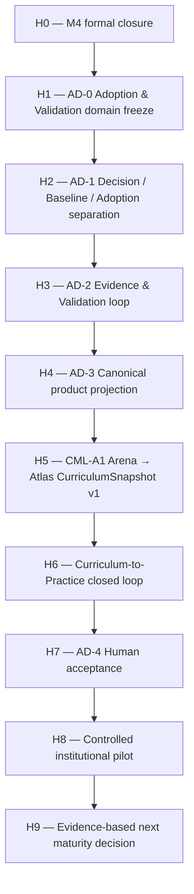
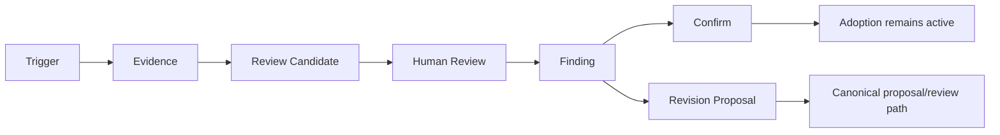

# CurManLight Arena — Product Roadmap 2026–2027

Status: **GOVERNED ROADMAP — DOES NOT SELF-AUTHORIZE IMPLEMENTATION**  
Date: **2026-09-20**  
Scope: CurManLight Arena, Curriculum Atlas interoperability, Docente OS curricular handoff  
Product principle: **Arena governs → Atlas navigates → Docente OS operates**

## 1. Purpose

This roadmap turns the current maturity work into a coherent product direction.

The objective is not to accumulate features. It is to close the institutional curriculum lifecycle with explicit provenance, authority, adoption, review and evidence while preserving the product boundaries already stabilized in M4.

The roadmap is subordinate to:

1. current governance decisions;
2. `docs/architecture/INTEGRATED_PROJECT_GOVERNED_MEMORY_V1.md`;
3. `AGENTS.md`;
4. `docs/WORKING_PROTOCOL.md`;
5. `CURRICULUM_ADOPTION_VALIDATION_DEVELOPMENT_GUIDE_V1.md`;
6. `ARENA_ATLAS_DOCENTE_OS_SURFACE_BOUNDARY_M4S4.md`;
7. the live M4 tracker #121.

A phase listed here may be **prepared** without being **authorized**.

### Execution-order compatibility

This document does **not** define a second execution sequence. The canonical cross-system execution order remains the H0–H5 completion/reset sequence in `DUAL_SYSTEM_CANONICAL_RESET_2026-09-18.md` together with the current governed memory. The labels used below are therefore **H0–H9 (strategic horizons)**, not execution phases. An H-horizon may advance only when the canonical execution order and current governance explicitly allow the corresponding tranche.

---

## 2. Product North Star

Arena becomes the institutional memory and governance system for curriculum.

It must be able to prove:

```text
authoritative/applicable sources
  -> governed curriculum baseline
  -> human proposal/review
  -> explicit institutional decision
  -> scoped adoption
  -> controlled downstream handoff
  -> professional implementation evidence
  -> human-governed validation
  -> confirmation or revision proposal
```

The product succeeds when a human can answer:

- what applies;
- why it applies;
- which sources support it;
- what is only a proposal;
- what has been decided;
- what has been adopted;
- for which scope and period;
- what changed;
- what practice evidence is asking to be reviewed;
- what state may safely leave Arena.

---

## 3. Design criteria for every roadmap slice

Every slice must satisfy all applicable criteria below.

### C1 — Authority integrity

`Person != Role != Capability != Authority`

Missing authority fails closed.

### C2 — State separation

At minimum:

`Applicability != Baseline != Approval != Adoption != Validation`

and

`Proposal != Review != Institutional Decision`

### C3 — Provenance

Every consequential state must be traceable to source, version, actor/capability evidence and timestamp.

### C4 — Human agency

Automation and AI may assist analysis and drafting, but may not issue institutional approval, adoption or authority.

### C5 — Product boundary

- Arena: GOVERN
- Atlas: NAVIGATE
- Docente OS: OPERATE

### C6 — Data minimization

Pupil-level operational data do not cross into Arena.

### C7 — No shared source of truth

The three products remain independently deployable and do not share a canonical mutable database.

### C8 — Reuse before create

Before adding an entity, route, store or workflow, perform a differential audit: `EXISTS_REUSE | EXISTS_EXTEND | MISSING_REQUIRED | DUPLICATE_AVOID | FORBIDDEN`.

### C9 — Accessible human-task design

The user must understand status, authority, consequence, recovery and next action without implementation knowledge.

### C10 — Exact-evidence promotion

Release claims are bound to exact SHA, automated evidence, deployment identity and human review where required.

---

## 4. Strategic-horizon overview (non-execution)



---

## 5. H0 — M4 formal closure

### Goal

Convert the current advanced controlled Beta / M4 promotion candidate into a formally governed controlled-production-pilot state only after all required same-candidate human evidence is complete.

### Required

- exact candidate identity;
- automated gates on the correct exact head;
- immutable Beta publication;
- public smoke identity;
- same-candidate mobile and desktop human review per G5;
- reconciled M4 evidence registry;
- final decision receipt;
- tracker #121 closed only after the decision is effective.

### Not allowed

- treating a prior HVA as current after interaction changes;
- changing the candidate after human review without republishing/reviewing;
- starting a broad feature train before closure.

### Exit

`ARENA_M4_CONTROLLED_PRODUCTION_PILOT`

---

## 6. H1 — AD-0 Adoption & Validation domain freeze

### Goal

Freeze domain semantics before UI or persistence mutation.

### Canonical objects to define

#### Adoption

Institutional act that makes a specific curriculum baseline operative for a scope and period.

Minimum fields:

- adoptionId;
- curriculum baseline/version reference;
- institutional decision reference;
- scope;
- effectiveFrom;
- effectiveUntil optional;
- status;
- provenance;
- authority evidence;
- recordedAt;
- supersedes/supersededBy.

#### AdoptionScope

Must support:

- institution/workspace;
- academic year;
- school order;
- class/cohort where relevant;
- discipline/area where relevant;
- any other governed applicability dimension.

#### ValidationReview

Binds:

- target adoption/baseline;
- review scope;
- trigger;
- evidence references;
- reviewer/authority context;
- findings;
- result;
- timestamps;
- provenance.

#### ReviewTrigger

Examples:

- normative source changed;
- applicability changed;
- review due date reached;
- implementation issue;
- coverage problem;
- institutional request;
- professional clarification request.

#### ImplementationEvidence envelope

Professional evidence only; no direct authority mutation.

### Required negative rules

- approval does not automatically mean active adoption;
- review start does not invalidate an active adoption;
- evidence does not equal decision;
- AI output does not equal authority;
- Docente OS observation does not equal Arena canonical write.

### Exit

`ARENA_AD0_DOMAIN_CONTRACT_FROZEN`

---

## 7. H2 — AD-1 Decision → Baseline → Adoption separation

### Goal

Make institutional decisions, resulting baselines and adoption explicit and independently auditable.

### Product behavior

A human should be able to inspect:

```text
Proposal
  -> Review
  -> Institutional Decision
  -> Resulting Baseline
  -> Adoption decision / scope
  -> Active adoption state
```

### Required deliverables

- one structured institutional decision ledger;
- baseline supersession history;
- explicit Adoption entity and scope;
- UI language that distinguishes approved from adopted/in-force;
- compatibility adapter for legacy decision models;
- no duplicate user-facing decision source of truth.

### Core acceptance example

The system must support:

> Curriculum Tecnologia v1.3 was approved by decision D-42, adopted for the lower-secondary Technology scope for A.S. 2026/27, effective from date X.

without inferring any of these states from the others.

### Exit

`ARENA_AD1_ADOPTION_CANONICAL`

---

## 8. H3 — AD-2 Evidence & Validation loop

### Goal

Move from static curriculum governance to governed continuous validation.

### Core model



### Evidence classes

- normative/source evidence;
- curriculum evidence;
- adoption evidence;
- implementation evidence;
- professional human observations;
- validation evidence.

### Professional return from Docente OS

Allowed concepts:

- `CurriculumCoverageObservation`;
- `ImplementationIssue`;
- `ClarificationRequest`;
- `RevisionSuggestion`.

Forbidden:

- pupil identifiers;
- raw pupil feedback histories;
- automatic proposal approval;
- automatic baseline mutation;
- automatic adoption;
- shared mutable state.

### Periodic review

Adoption metadata should support:

- reviewDueAt;
- review cadence/policy;
- current review state;
- effective period.

### Exit

`ARENA_AD2_VALIDATION_LOOP_CANONICAL`

---

## 9. H4 — AD-3 Canonical product projection

### Goal

Project the new domain through the existing product surfaces rather than creating another process application.

### Home → Curriculum Control Room

Must answer:

- current adopted baseline;
- scope and academic year;
- source/applicability changes;
- open review;
- next action for current role;
- new professional evidence requiring triage;
- upcoming review due.

### Curricolo

Must distinguish:

- applicable framework;
- baseline;
- adoption;
- review state;
- what changed;
- provenance.

### Fascicolo

Becomes the canonical Source Registry UI for:

- source identity;
- source version;
- verification;
- authority class;
- applicability;
- links to curriculum content.

### Riesame

Becomes the single user-facing decision workspace for:

- proposal;
- evidence;
- professional review;
- team/vertical review;
- institutional decision;
- resulting effects on baseline/adoption.

### Documenti / Handoff

Must export explicit:

- baseline identity;
- adoption state;
- applicability context;
- provenance;
- structural/authority fingerprint;
- target consumer;
- acceptance requirement.

### Verifiche

Must expose blockers and recovery, not generic certification language.

### Guida

Must explain human tasks, not internal architecture.

### Forbidden

- new primary `Processo` governance model duplicating Riesame;
- UDA authoring returning to Arena;
- daily classroom operations;
- teacher material archive.

### Exit

`ARENA_AD3_PRODUCT_PROJECTION_PASS`

---

## 10. H5 — CML-A1 Arena → Atlas canonical snapshot

### Goal

Make Atlas a reliable read-only projection of governed Arena state.

### Contract

`CurriculumSnapshot v1`

Minimum:

- snapshot id/version;
- exact source/release identity;
- stable curriculum node ids;
- provenance;
- authority/lifecycle state;
- normative references;
- relationships approved for publication;
- deterministic structural/authority fingerprint.

### Rules

- Atlas cannot promote proposal to approved;
- Atlas cannot mutate Arena;
- an incompatible schema fails closed;
- no personal data;
- same nominal version with changed authority/structure must produce a different fingerprint where meaningful.

### Consumer evidence

- schema validation;
- deterministic fixture;
- Atlas consumer test;
- mismatch negative tests;
- exact release identity.

### Exit

`CML_A1_CURRICULUM_SNAPSHOT_PASS`

---

## 11. H6 — Curriculum-to-Practice closed loop

### Goal

Complete the governed loop without blurring product ownership.

### Canonical outbound

```text
Arena curriculum release
  -> Docente OS intake/revalidation
  -> Annual Plan binding
  -> UDA binding
  -> section/lesson execution
  -> evidence/feedback
  -> teacher review
  -> professional observation
  -> Arena governed intake
```

### Execution

Use the existing C2P tranches and gates:

- C2P-01 contract audit;
- C2P-02 Arena release boundary;
- C2P-03 Docente OS intake;
- C2P-04 annual plan binding;
- C2P-05 UDA binding;
- C2P-06 evidence/feedback;
- C2P-07 professional observation;
- C2P-08 Arena observation intake;
- C2P-09 version transition;
- C2P-10 golden path.

Each tranche remains independently governed.

### Exit

`C2P_GOLDEN_PATH_PASS`

---

## 12. H7 — AD-4 Human Adoption & Validation Acceptance

### Goal

Prove that humans understand the institutional lifecycle on an immutable release.

### Required human tasks

A reviewer must be able to:

1. identify the currently adopted curriculum;
2. identify adoption scope and period;
3. understand why it applies;
4. inspect source provenance;
5. distinguish open review from changed baseline;
6. understand who can decide;
7. inspect evidence behind a proposed change;
8. understand what downstream handoff does and does not do;
9. understand that implementation evidence may trigger review but cannot mutate authority automatically;
10. recover from missing context/authority.

### Devices

Desktop and mobile where required by the active acceptance protocol.

### Exit

`ARENA_AD4_HUMAN_ACCEPTANCE_PASS`

---

## 13. H8 — Controlled institutional pilot

### Goal

Observe real professional use over time instead of immediately expanding features.

### Pilot evidence to collect

- task completion and recovery;
- number/type of source changes;
- review cycle duration;
- blocked paths;
- adoption-state misunderstandings;
- handoff/revalidation events;
- professional observations returned from Docente OS;
- accessibility feedback;
- incident/recovery evidence;
- maintenance burden.

### Metrics discipline

Metrics must measure workflow and product quality, not individual teacher/student performance.

No pupil-level analytics enter Arena.

### Pilot outcomes

At the end of the window classify each finding:

- `MATURITY_REQUIRED`;
- `PILOT_REQUIRED`;
- `PROFESSIONAL_GAP_CONFIRMED`;
- `DEFERRED`;
- `REJECTED_BOUNDARY_VIOLATION`.

---

## 14. H9 — Next maturity decision

Only evidence from the controlled pilot may justify the next major product phase.

Possible outcomes:

- remain in controlled pilot and stabilize;
- promote to a higher operational maturity class;
- open a bounded next capability;
- revise domain/UI assumptions;
- retire unnecessary legacy surfaces.

There is no automatic progression based on elapsed time or feature count.

---

## 15. Deliberately deferred ideas

The following are not roadmap priorities until the curriculum lifecycle closes:

- new Arena Learning Object store;
- automatic UDA composer inside Arena;
- classroom/student workspace;
- student profiling;
- broad new AI assistant surfaces;
- shared database with Atlas or Docente OS;
- automatic institutional decisions;
- automatic cross-product writes;
- generic RoleView platform detached from a validated human task;
- a new dashboard layer that duplicates Home;
- new external frameworks without explicit authorization.

---

## 16. AI role

AI may:

- compare sources;
- identify inconsistencies;
- summarize;
- draft revision text;
- propose links;
- explain impact;
- assist evidence classification.

AI may not:

- approve a curriculum;
- create institutional authority;
- activate an adoption;
- turn evidence into a decision;
- bypass a human confirmation;
- silently mutate another product.

---

## 17. Definition of done for any future slice

A slice is done only when:

- domain semantics are explicit;
- positive and negative tests exist;
- provenance is preserved;
- authority fails closed;
- cross-product ownership remains coherent;
- applicable accessibility/HIM evidence passes;
- CI/build passes on exact head;
- immutable deploy identity is proven when required;
- human acceptance is collected where required;
- rollback/recovery is defined;
- adjacent non-effects are documented.

---

## 18. Roadmap governance

This file describes direction. It does not authorize implementation.

Before starting or authorizing work associated with a strategic horizon:

1. re-read governed memory;
2. check current `main` SHA;
3. inspect open promotion/decision PRs;
4. verify whether the tranche is authorized;
5. open a dedicated issue/PR;
6. freeze exact acceptance criteria;
7. implement the minimum delta;
8. stop at the gate.

If a higher-order gate is open, record the next tranche as `PREPARED_BLOCKED_PROMOTION`.

---

## 19. Product statement

The intended mature form of Arena is:

> **the governed institutional memory of curriculum: it knows where the curriculum comes from, why it applies, what humans decided, what the institution adopted, what changed, and what professional practice is asking to be reviewed.**
