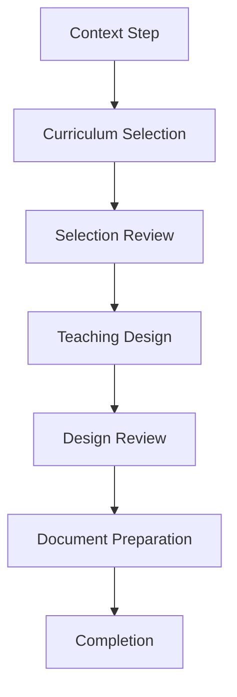

# CML-633I — Cross-Area Orchestration

## Integration Strategy

The guided teacher workflow orchestrates existing domains and features without creating parallel systems or duplicating data. The workflow uses existing functionality from multiple domains to create a cohesive teacher experience.

## Integration Points

### 1. Curriculum Consultation (CML-633E/H)
- **Purpose**: Provides access to curriculum references
- **Integration**: Used in "curriculum-selection" step
- **Key Functions**:
  - Consult curriculum references
  - Filter by discipline, order, source
  - View source types (current, proposal, legacy)

### 2. Revision Decision Workflow (CML-633G/H)
- **Purpose**: Manages proposal and decision states
- **Integration**: Used in "selection-review" step
- **Key Functions**:
  - Review proposal status
  - Check qualification status
  - Access revision history

### 3. Design Curriculum Selection (Existing Feature)
- **Purpose**: Provides design selection interface
- **Integration**: Reused in "teaching-design" step
- **Key Features**:
  - Design template interface
  - Snapshot preservation
  - UDA integration

### 4. Document System (CML-633F/H)
- **Purpose**: Document creation and export
- **Integration**: Used in "document-preparation" step
- **Key Functions**:
  - Document type selection
  - Preview functionality
  - Export options (HTML, JSON, Print)

## Data Flow

## Data Flow Analysis

1. **Context Step**: Uses institution configuration data from session features
2. **Curriculum Selection**: Pulls data from curriculum domain and revision domain
3. **Selection Review**: Validates selections using existing revision checks
4. **Teaching Design**: Uses design domain to create structured output
5. **Design Review**: Validates design using existing design domain functions
6. **Document Preparation**: Integrates with document system for final output
7. **Completion**: Final state showing completed steps and available actions

## Data Flow Constraints

- No data duplication between domains
- No direct database writes outside existing domain patterns
- All data modifications go through validated domain functions
- No new domain tables or schema changes
- All state changes are reversible via reset action

## Error Handling Strategy

Each step provides specific error messages with concrete next actions:

- **Source Unavailable**: "Sorgente non disponibile - Verifica la connessione o riprova più tardi"
- **Version Mismatch**: "Versione modificata - La proposta deve essere completata prima della revisione"
- **Missing Source**: "Fonti mancanti - Seleziona almeno un riferimento valido"
- **Legacy Content**: "Contenuto legacy in uso - Verifica la qualificazione prima di procedere"
