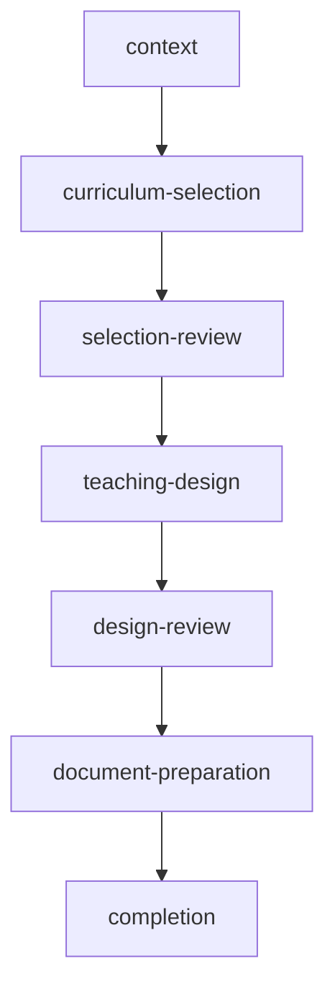

# CML-633I — Guided Workflow State Model

## State Model Overview

The guided workflow state model represents the teacher's progress through the instructional design process. It contains only references and advancement state - no domain data duplication.

## State Structure

```ts
interface GuidedTeacherWorkflowState {
  /** Current step in the workflow */
  currentStep: GuidedWorkflowStep;

  /** Steps that have been completed (in order) */
  completedSteps: readonly GuidedWorkflowStep[];

  /** Selected curriculum references (can be multiple) */
  selectedCurriculumRefs: readonly EntityReference[];

  /** Selected revision references (can be multiple) */
  selectedRevisionRefs: readonly EntityReference[];

  /** Selected design reference (single active design) */
  selectedDesignRef?: EntityReference;

  /** Generated document reference (if any) */
  generatedDocumentRef?: DocumentReference;

  /** Warnings accumulated during the workflow */
  warnings: readonly GuidedWorkflowWarning[];
}
```

## Workflow Steps

1. **context** - Define work context (institution, school year, order, role)
2. **curriculum-selection** - Select curriculum references for design
3. **selection-review** - Check selections for validity
4. **teaching-design** - Build teaching design using selected references
5. **design-review** - Verify design completeness and correctness
6. **document-preparation** - Prepare document for export
7. **completion** - Work completed, review actions

## State Management

The workflow state is managed through a lightweight Zustand store integration. The state persists through session changes but is reset explicitly without affecting domain artifacts.

## Warning Types

The workflow supports the following warning types:

- `institution-not-configured`: Institution not configured
- `legacy-content`: Legacy content being used
- `experimental-content`: Experimental content being used
- `provisional-proposal`: Proposal still in review
- `missing-sources`: Missing or incomplete sources
- `source-unavailable`: Source not available
- `source-modified`: Source modified since selection
- `duplicate-selection`: Duplicate selection detected
- `legacy-designation`: Legacy designation present

## State Transitions

The workflow follows a strict sequential pattern:



## State Transitions

- **advanceToNextStep**: Moves to next step if prerequisites met
- **goToPreviousStep**: Returns to previous step
- **goToStep**: Jumps directly to specified step (if accessible)
- **resetWorkflow**: Resets to initial state without clearing domain artifacts
- **setSelectedDesign**: Updates design reference
- **addCurriculumReference**: Adds curriculum reference to selection
- **removeCurriculumReference**: Removes curriculum reference from selection
- **addRevisionReference**: Adds revision reference to selection
- **removeRevisionReference**: Removes revision reference from selection
- **setGeneratedDocument**: Sets document reference
- **addWarning**: Adds warning to workflow state
- **removeWarning**: Removes warning from workflow state
